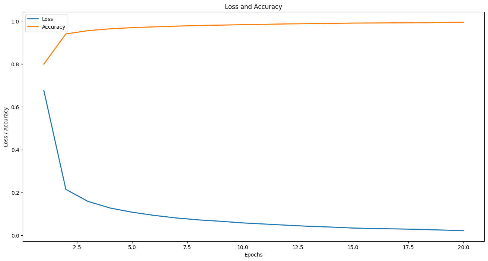
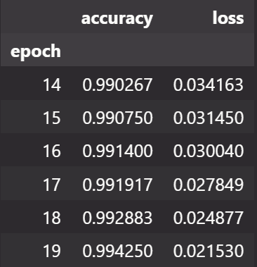

# mnist-classifier-of-numbers-project

## ❗ The goal of this research was to develop a neural network that would predict the enrollment of numbers with 99% accuracy.

#### *The network consists of 4 hidden layers, the activator is Relu, and the optimizer is Adam. all methods are standard from keras. The neural network went through 20 epochs and was able to achieve an accuracy of more than 0.95 already at the 9th epoch.*  

```
epochs = 20
batch_size = 256
activation = "relu"
optimizer = "Adam"

model = models.Sequential()

model.add(layer=layers.Input(shape=(28 * 28,)))
model.add(layer=layers.Dense(64, activation=activation))
model.add(layer=layers.Dense(32, activation=activation))
model.add(layer=layers.Dense(16, activation=activation))
model.add(layer=layers.Dense(10, activation=activation))
model.add(layer=layers.Softmax())

model.compile(loss='categorical_crossentropy', 
              optimizer=optimizer, 
              metrics=['accuracy'])

history = model.fit(ready_features_train, ready_targets_train,
                    epochs=epochs,
                    batch_size=batch_size,
                    verbose=0,
                    validation_data=(ready_features_test, ready_targets_test))
```
#### The learning process can be seen on the graph and table



## ❗ For the convenience of the next use of the model, the 'mnist_classifier' class was written.To use the model, you need to create an instance of the class.

```
model = load_model("mnist_classifier.keras")

classifier = mnist_classifier(model)

predicted_number = classifier.classify_number_by_image(number_image=some_image_matrix[some_index])
```